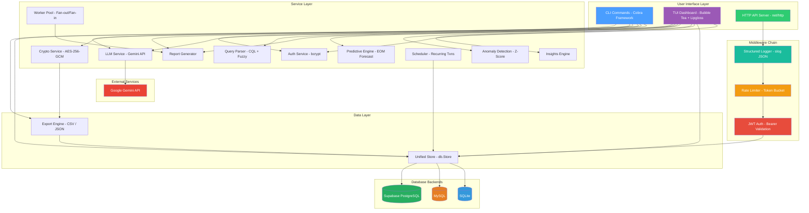
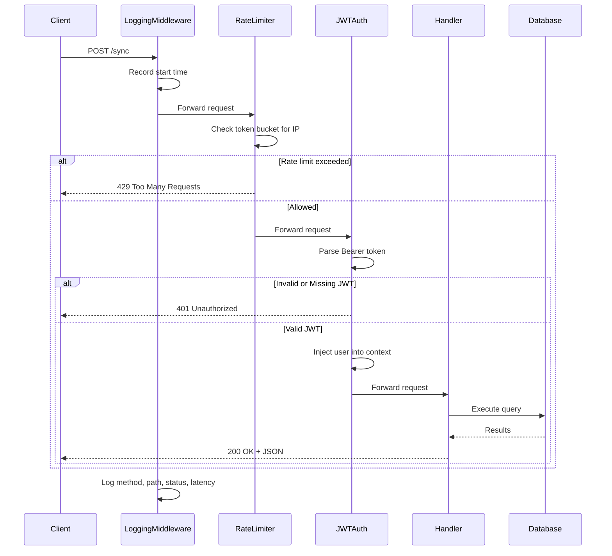
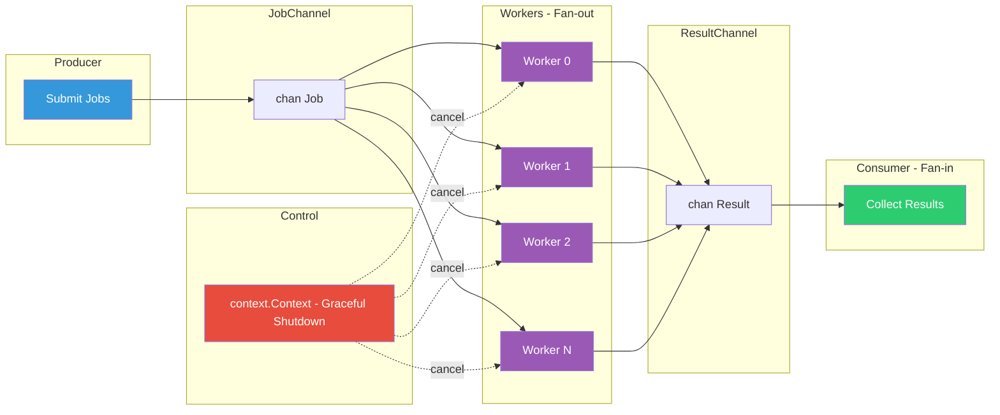
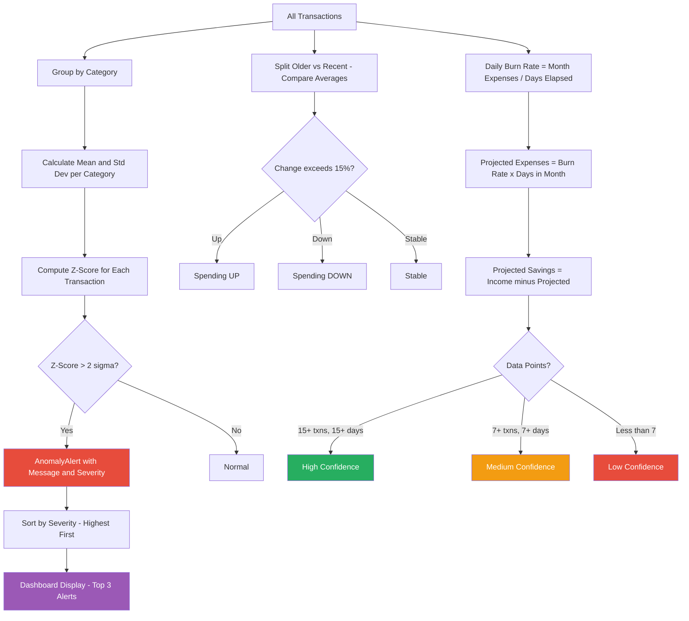
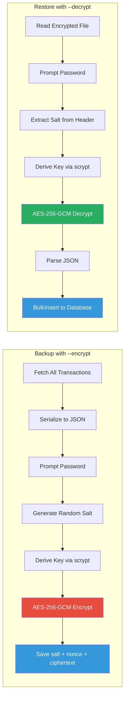
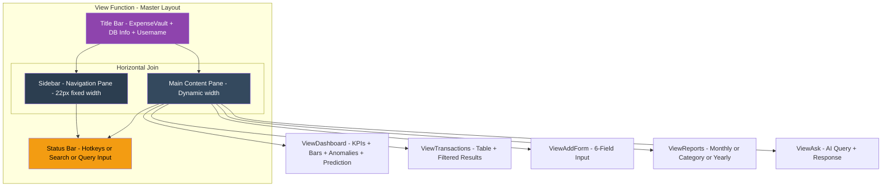
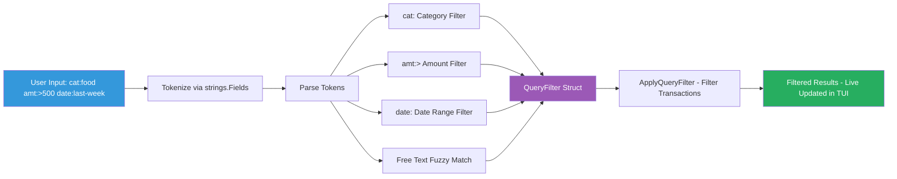

# ExpenseVault — Architecture Diagrams

## 1. System Architecture

---

## 2. Request Flow — HTTP Middleware Chain

---

## 3. Worker Pool — Fan-out/Fan-in Pattern

---

## 4. Anomaly Detection and Prediction Pipeline

---

## 5. Encrypted Backup and Restore Flow

---

## 6. TUI Pane Layout Architecture

---

## 7. CQL Query Pipeline

